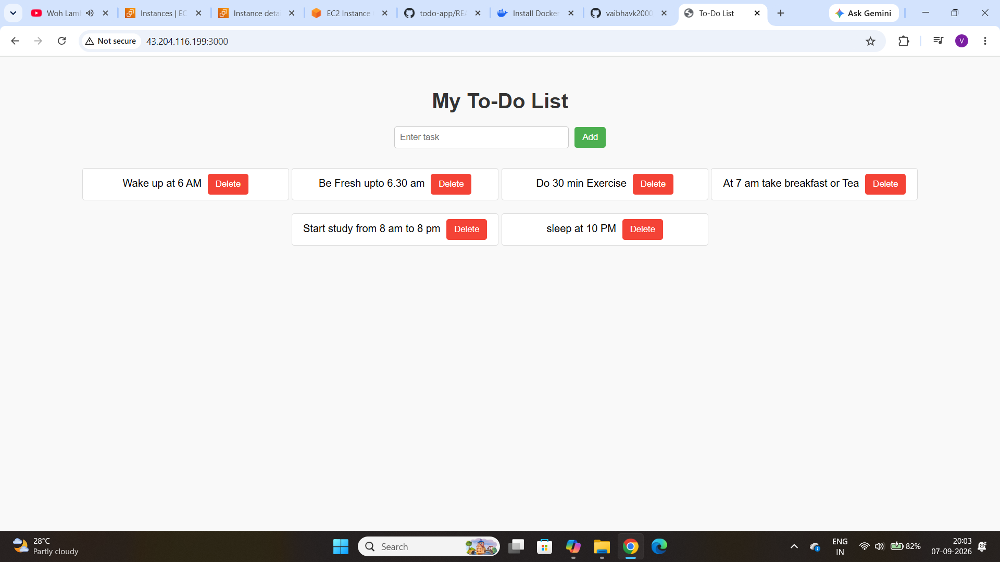

# 📝 To-Do List App (Node.js + Express)

A simple To-Do List application built with **Node.js**, **Express**, and **EJS templates**.  
This app allows users to add and delete tasks, styled with CSS, and can be containerized with Docker.

---

## 🚀 Features
- Add new tasks
- Delete tasks
- Simple UI with EJS templates
- Docker-ready for deployment
- CI/CD pipeline support with Jenkins

---

## 📂 Project Structure
```
todo-app/
├── index.js
├── package.json
├── views/
│   └── index.ejs
├── public/
│   └── styles.css
├── README.md
├── Dockerfile
├── Jenkinsfile
├── sonarjenkins/
│   └── sonar-project.properties
└── todo.png
```

---

## 🛠 Create the Dockerfile to run app 

```bash
# Use official Node.js image as base
FROM node: 18
# Set working directory inside container
WORKDIR /usr/src/app
# Copy package.json and package-lock.json first
COPY package*.json ./
# Install dependencies
RUN npm install
# Copy the rest of the application code
COPY . .
# Expose port 3000
EXPOSE 3000
# Start the app
CMD ["npm", "start"] docker file
npm install

```
## 🐳 Run with Dockerfile
```bash
# Build image
docker build -t todo-app .

# Run container
docker run -p 3000:300 todo-app
```
Visit: `http://localhost:3000`

---

## 🛠 Create the Docker-Composed.yml to run app
```bash
version: '3.8'

services:
  todo-app:
    build: .
    container_name: todo-app-container
    ports:
      - "3000:3000"
    restart: always

```
## 🐳 Run with Docker composed
```bash
# up the app
docker composed up -d --build

```
---

## 📸 Demo

Here’s what the app looks like:



---

## ⚙️ CI/CD
- **Jenkinsfile** included for pipeline automation.
- **SonarQube** integration via `sonarjenkins/`.

---

## 📜 License
This project is licensed by vaibhav.
